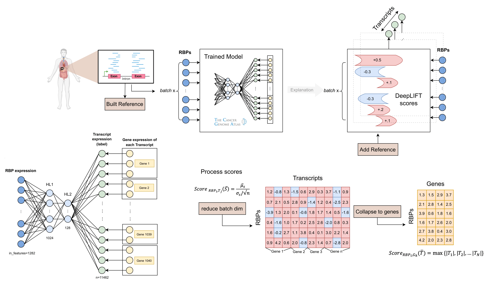

# DeepRBP
## A novel deep neural network for inferring splicing regulation
#### Publication: https://doi.org/10.1101/2024.04.11.589004
<p align="center">
  <a href="https://www.python.org/downloads/release/python-390/">
    
  </a>
  <a href="#">
    
  </a>
  <a href="#">
    
  </a>
  <a href="https://opensource.org/licenses/MIT">
    
  </a>
</p>

## Description
<p align="center">
    
</p>

Alternative splicing plays a pivotal role in various biological processes. In the context of cancer, aberrant splicing patterns can lead to disease progression and treatment resistance. 
Understanding the regulatory mechanisms underlying alternative splicing is crucial for elucidating disease mechanisms and identifying potential therapeutic targets.
We present DeepRBP, a deep learning (DL) based framework to identify potential RNA-binding proteins (RBP)-Gene regulation pairs for further in-vitro validation. DeepRBP is composed of a DL model 
that predicts transcript abundance given RBP and gene expression data coupled with an explainability module that computes informative RBP-
Gene scores using DeepLIFT. We show that the proposed framework is able to identify known RBP-Gene regulations, demonstrating its applicability to identify new ones.

## Installation
To install **DeepRBP**, follow these steps:

```bash
git clone https://github.com/ML4BM-Lab/DeepRBP.git
cd DeepRBP
conda create -n DeepRBP python=3.9 # conda create --prefix  /data/jsanchoz/conda-env/DeepRBP python=3.9
conda activate DeepRBP # conda activate /data/jsanchoz/conda-env/DeepRBP
pip install -e .
```

## Datasets information
In this project, we have used several databases. On one hand, we have used a cohort that contains, among others, samples from TCGA and GTEx. The samples from the former have been used to train the DeepRBP predictor that learns transcript abundances, and the samples from GTEx have been used to evaluate how well the predictive model generalizes.

On the other hand, the DeepRBP explainer has been validated using TCGA samples from a tumor type to calculate the GxRBP scores and a binary matrix with shape GxRBP indicating whether the evidence in POSTAR3 experiments indicates regulation or not. Also, the DeepRBP explainer has been tested in-vitro knockdown experiments. Below, you are instructed on how to download these data.

### Data Download
You can download the necessary datasets from the [UCSC Xena platform](https://xenabrowser.net/) (Goldman et al., 2020).

To simplify the process, we provide a script that handles downloading the raw data for this project. To initiate the download, execute the following command (approx. 20 minutes):

```bash
sbatch slurm/download_data.sh
```

The datasets will be automatically saved to the following directory: `/data/training_module/raw`

### Data preprocessing 


In this step, que procesos hacemos? con que objectivo? (cual es el output).
Como se ejecuta? 2 opciones.

```bash
sbatch slurm/generate_model_inputs.sh
```
  
puedes ejecutar en consola de la siguiente forma: 

prepare-model-inputs --raw_data_dir "/scratch/jsanchoz/DeepRBP/data/training_module/raw" \
                     --selected_genes_dir "/scratch/jsanchoz/DeepRBP/data/training_module/selected_genes_rbps" \
                     --output_dir "/scratch/jsanchoz/DeepRBP/data/training_module/processed" \
                     --transcript_expression_file "TcgaTargetGtex_rsem_isoform_tpm.gz" \
                     --gene_expression_file "TcgaTargetGtex_rsem_gene_tpm.gz" \
                     --phenotype_data_file "TcgaTargetGTEX_phenotype.txt" \
                     --chunk_size 1000 \
                     --gene_selection True \
                     --gene_transcript_mapping_file "getBM.csv" \
                     --splicing_genes_file "Table_S5_Cancer_splicing_gene_eyras.xlsx" \
                     --cancer_genes_file "Table_S6_Cancer_gene_eyras.xlsx" \
                     --gene_census_file "Table_Cancer_Gene_Census.tsv" \
                     --rbp_genes_file "Table_S2_list_RBPs_eyras.xlsx"

donde cada elemento es: 


# (explicar más en detalle), que entra que sale, como , porque  decir como se consiguen los RBPs, que procesos hacemos etc

# filter TCGA and GTEx samples and save the gene and transcript expression matrices for each dataset. From the gene expression matrix, we create a subset containing the expression of RNA-binding proteins (RBPs) genes, which will serve as the primary input for our model.

(lo que antes era create_data.sh)


# nuevo organigrama !!! (puede estar aun sujeto a muchos cambios)

/DeepRBP
├── data
│   ├── training_module                       
│   │   ├── raw                                # Datos crudos descargados de TCGA y GTEx
│   │   │   ├── TcgaTargetGtex_rsem_isoform_tpm.gz   # Datos de transcritos en log2(tpm+0.001) (TCGA y GTEx)
│   │   │   ├── TcgaTargetGtex_rsem_gene_tpm.gz      # Datos de genes en log2(tpm+0.001) (TCGA y GTEx)
│   │   │   ├── TcgaTargetGTEX_phenotype.txt         # Datos de fenotipo de TCGA, GTEx y TARGET
│   │   │
│   │   ├── selected_genes_rbps                # Listas seleccionadas de genes y RBPs relevantes
│   │   │   ├── Table_Cancer_Gene_Census.tsv        # Tabla con el censo de genes de cáncer
│   │   │   ├── Table_S2_list_RBPs_eyras.xlsx      # Tabla S2 con lista de RBPs (Eyras)
│   │   │   ├── Table_S5_Cancer_splicing_gene_eyras.xlsx   # Tabla S5 con genes de splicing en cáncer (Eyras)
│   │   │   ├── Table_S6_Cancer_gene_eyras.xlsx            # Tabla S6 con genes de cáncer (Eyras)
│   │   │   ├── getBM.csv                          # Relaciona genes id con su trans id correspondiente
│   │   │
│   │   ├── processed   # Datos procesados y listos para ser usados en el modelo
│   │   │   ├── TCGA / GTEx                      # Datos de TCGA o GTEX(sin normalizar, escalar ni dividir en Train/Test)
│   │   │   │   ├── RBPs_log2p_tpm.csv           # Expresión de RBPs en datos de TCGA
│   │   │   │   ├── gn_expr_each_iso_tpm         # Expresión de genes en datos de TCGA
│   │   │   │   ├── trans_log2p_tpm.csv          # Expresión de transcritos en datos de TCGA
│   │   │   │   ├── phenotype_metadata.csv       # Datos de fenotipo de TCGA o GTEX
│
│   ├── explainability_module                   # Módulo dedicado a la validación y explicación del modelo
│   │   ├── postar3                             # Datos de POSTAR3 para validación
│   │   └── real_kds                            # Datos de experimentos de knockdown (KD)
│ 
├── output/                           # Carpeta para almacenar resultados y modelos entrenados
│   ├── checkpoints/                  # Almacena checkpoints del modelo durante el entrenamiento
│   ├── results/                      # Almacena los resultados de las evaluaciones y análisis
│   │   ├── analysis/                 # Sección dedicada a análisis y resultados
│   │   │   ├── TCGA-Lung-Breast-2024-10-09/   # Identificador único para esta corrida
│   │   │   │   ├── train_prediction_model/    # Resultados del módulo de entrenamiento
│   │   │   │   │   ├── data/                  # Datos generados durante el análisis
│   │   │   │   │   │   ├── pre-scaling/       # Resultados de expresiones antes del escalado
│   │   │   │   │   │   │   ├── rbp_expr_log2p_tpm.csv         # Expresión de RBPs en log2(tpm+1)
│   │   │   │   │   │   │   ├── gene_expr_tpm.csv              # Expresión de genes en tpm
│   │   │   │   │   │   │   ├── trans_expr_log2p_tpm.csv       # Expresión de transcritos en log2(tpm+1)
│   │   │   │   │   │   │   └── metadata_df.csv                # Metadata de los samples, indicando el set
│   │   │   │   │   │   
│   │   │   │   │   │   ├── post-scaling/                      # Resultados después del escalado y división de sets
│   │   │   │   │   │   │   ├── train_data/                    # Datos de entrenamiento escalados
│   │   │   │   │   │   │   │   ├── scaled_train_rbp_expr_log2p_tpm.csv  # Expresión de RBPs log2(TPM+1) escalada (0-1)
│   │   │   │   │   │   │   │   ├── train_gene_expr_tpm.csv       # Expresión de genes en TPM
│   │   │   │   │   │   │   │   ├── train_trans_expr_log2p_tpm.csv # Expresión de transcritos log2(TPM+1)
│   │   │   │   │   │   │   │   └── train_metadata_df.csv        # Metadata del set de entrenamiento
│   │   │   │   │   │   │   
│   │   │   │   │   │   │   ├── val_data/                       # Datos de validación escalados
│   │   │   │   │   │   │   │   ├── ...
│   │   │   │   │   │   │   
│   │   │   │   │   │   │   ├── test_data/                      # Datos de prueba escalados
│   │   │   │   │   │   │   │   ├── ...
│   │   │   │   │   │   │   ├── scaler/                          # Objeto scaler utilizado para la normalización
│   │   │   │   │   │   │   │   └── scaler.pkl                    # Archivo del scaler guardado en formato pickle
│   │   │   │   │   │   │   
│   │   │   │   │   │   │   └── sigma.txt                        # Valor de desviación estándar utilizado en el escalado
│   └── logs/                # Carpeta general para logs de todo el proyecto

├── notebooks  # Notebooks de análisis y pruebas
│   ├── Tutorial_predict_transcript_expression.ipynb  # Tutorial para predecir expresión de transcriptos
│   ├── Tutorial_replicate_postar3.ipynb  # Tutorial para replicar los resultados en POSTAR3
│   └── Tutorial_replicate_real_kds.ipynb  # Tutorial para replicar knockdown experiments

├── src  # Código principal del paquete DeepRBP
│   ├── deeprbp
│   │   ├── __init__.py  # Inicialización del paquete DeepRBP
│   │   ├── model.py  # Definición y arquitectura del modelo de predicción (RBP-Gene) (class )
│   │   ├── explainability.py  # Cálculo de scores de DeepLIFT para explainability
│   │   ├── data_loader.py  # Clase para cargar, procesar y dividir los datos en train/test
│   │   ├── config_loader.py  # Clase para cargar configuraciones desde un JSON
│   │   ├── utils.py  # Funciones auxiliares
#│   │   ├── evaluate.py  # Evaluación del modelo ??
│   │   └── pretrained_model/  # Contiene el modelo preentrenado y sus archivos asociados 
                                            (OJO a esto tenemos que hacer referimento en el data_loader tb luego)
│   │       ├── config.json  # Configuración del modelo preentrenado
│   │       ├── model.pt  # Modelo preentrenado
│   │       ├── scaler_sfs.joblib  # Escaladores usados en el preprocesamiento
│   │       └── sigma_sfs.txt  # Parámetros adicionales del modelo

│   ├── data_preprocessing/  # Preprocesamiento de datos crudos
│   │   └── prep_model_inputs.py  # Preprocesa los datos TCGA/GTEx para generar matrices de input
│   │   └── .py  # 

│   └── tests/  # Tests unitarios para el paquete DeepRBP
│       └── test_data_loader.py  # Test unitario para la clase DataLoader (por ejemplo)

├── slurm  # Scripts ejecutables
│   ├── download_data.sh  # Script para descargar datos (TCGA, GTEx)
│   ├── generate_model_inputs.sh  # Script para procesar los datos descargados y generar matrices de input
│   ├── run_DeepRBP_predictor.sh  # Script para entrenar y evaluar el predictor DeepRBP
│   └── run_explainability.sh  # Script para ejecutar el módulo de explainability
├── images  # Imágenes para visualización (por ejemplo, diagramas o ejemplos de resultados)

├── README.md  # Instrucciones y documentación del proyecto

├── .gitignore  # Archivos y carpetas a ignorar en el control de versiones

└── setup.py  # Script de instalación para el paquete DeepRBP
