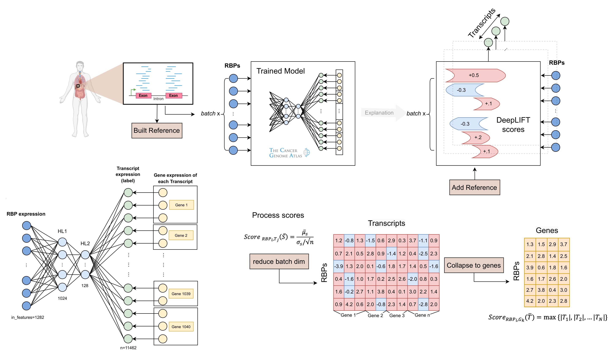

# DeepRBP: A novel deep neural network for inferring splicing regulation
#### Publication: https://doi.org/10.1101/2024.04.11.589004

<p align="center">
  <a href="https://www.python.org/downloads/release/python-390/">
    
  </a>
  <a href="#">
    
  </a>
  <a href="#">
    
  </a>
  <a href="https://opensource.org/licenses/MIT">
    
  </a>
</p>

## Description
<p align="center">
    
</p>

Alternative splicing plays a pivotal role in various biological processes. In the context of cancer, aberrant splicing patterns can lead to disease progression and treatment resistance. Understanding the regulatory mechanisms underlying alternative splicing is crucial for elucidating disease mechanisms and identifying potential therapeutic targets.  
We present DeepRBP, a deep learning (DL)-based framework to identify potential RNA-binding protein (RBP)-Gene regulation pairs for further *in-vitro* validation. DeepRBP is composed of:  

1. **Prediction module:** A DL model that predicts transcript abundance given RBP and gene expression data.  
2. **Explainability module:** Computes informative RBP-Gene scores using DeepLIFT.

Why Use DeepRBP?
Experimental methods like CLIP are expensive, labor-intensive, and require prior knowledge of the target RBP. DeepRBP offers a computational alternative, predicting regulatory interactions without these constraints. This approach is cost-effective, scalable, and capable of uncovering complex multi-RBP interactions often missed by traditional methods.

DeepRBP has been validated on cancer datasets like TCGA, revealing potential novel regulatory relationships in AML, KICH, and HCC.
---

## Installation
To install **DeepRBP**, follow these steps:

```bash
git clone https://github.com/ML4BM-Lab/DeepRBP.git
cd DeepRBP
conda create -n DeepRBP python=3.9 # conda create --prefix  /data/jsanchoz/conda-env/DeepRBP python=3.9
conda activate DeepRBP # conda activate /data/jsanchoz/conda-env/DeepRBP
pip install -e .
```

# Prediction Module
## Datasets Information
In this project, we utilized multiple datasets, including samples from The Cancer Genome Atlas (TCGA) and the Genotype-Tissue Expression (GTEx) project. We used 80% of the TCGA samples to train the DeepRBP predictor, which learns to predict transcript abundances. The remaining TCGA samples, along with the GTEx samples, were employed to assess the model's generalization capabilities.

## Data Download
You can download the necessary datasets from the [UCSC Xena platform](https://xenabrowser.net/) (Goldman et al., 2020). To automate the process, execute (approx. 20 minutes):

```bash
sbatch slurm/download_data.sh
```
The following files will be downloaded and stored in the `/data/training_module/raw` directory:

- **Gene expression data** (TcgaTargetGtex_rsem_isoform_tpm.gz)  
  This file contains gene expression levels measured in Transcripts Per Million (TPM) as log2(tpm + 0.001) format. TPM is a normalization method that accounts for both the length of the gene and the total number of reads in a sample, allowing for comparison of gene expression levels across different samples. It includes samples across TCGA, GTEx and TARGET (not used).

- **Transcript expression data** (TcgaTargetGtex_rsem_gene_tpm.gz)  
  Similar to the gene expression file, this file provides expression levels for various transcript isoforms also in TPM format as log2(tpm + 0.001) format. Similar to the isoform data, it includes expression levels for genes from TCGA, GTEx and TARGET datasets. It enables analyses focused on specific isoforms of genes, which can have different functional roles and regulatory mechanisms.

- **Gene count expression data** (TcgaTargetGTEX_phenotype.txt)
  This file contains raw gene counts in log2(expected_count+1) from TCGA, GTEx, and TARGET, representing the number of reads mapped to each gene. Unlike TPM, raw counts do not account for gene length or total sequencing depth. They are often used in statistical methods for differential expression analysis, as they provide a direct measure of sequencing data.

- **Phenotype metadata** (TcgaTargetGTEX_gene_expected_count.gz) 
  This text file contains important clinical and biological information about the samples from the TCGA, GTEx, and TARGET datasets.

## Data Preprocessing
In this step, we will load and preprocess the raw data files to prepare input matrices for both TCGA and GTEX datasets. Specifically, we will generate and save in `output_dir`, in this case we suggest to save them in `data/training_module/processed`:

- **RBP expression matrix**: `RBPs_log2p_tpm.csv` (in log2(TPM+1)) derived from the gene expression data, with dimensions `n_patients x num_RBPs`.
- **Transcript expression matrix**: `trans_log2p_tpm.csv` (in log2(TPM+1)) with dimensions `n_patients x num_transcripts`.
- **Gene expression matrix**: `gn_tpm.csv` (in TPM) with dimensions `n_patients x num_genes`.
- **Metadata file**: `phenotype_metadata.csv`, containing phenotype information for each sample, indicating tissue or tumor type.
- **Gene count matrix**: `gn_counts.csv` (in counts) with dimensions `n_patients x num_RBPs`. For further differential expression analysis.

### Process Details
Among other tasks, this process includes:

1. Cleaning and standardizing phenotype data.
2. Cleaning gene and transcript expression and count data data by removing genome version annotations and aggregating loci.
3. Filtering out transcripts of genes with only one isoform.
4. Selecting genes and their transcripts for modeling based on either cancer-related genes or all protein-coding genes.
5. Filtering RNA-binding proteins (RBPs) for modeling and creating a subset RBP matrix from the gene matrix for expression.
6. Transforming gene expression to TPM (and counts), RBP and transcript expression to TPM. 
7. Transposing expression data so patients are rows and genes (or transcript IDs) are columns.
8. Saving processed expression and count data and phenotype metadata as CSV files in the specified output directory.

## Execution Command
To execute this, run:

```bash
prepare-model-inputs --raw_data_dir "/scratch/jsanchoz/DeepRBP/data/training_module/raw" \
                     --selected_genes_dir "/scratch/jsanchoz/DeepRBP/data/training_module/selected_genes_rbps" \
                     --output_dir "/scratch/jsanchoz/DeepRBP/data/training_module/processed" \
                     --transcript_expression_file "TcgaTargetGtex_rsem_isoform_tpm.gz" \
                     --gene_expression_file "TcgaTargetGtex_rsem_gene_tpm.gz" \
                     --gene_counts_file "TcgaTargetGTEX_gene_expected_count.gz" \
                     --phenotype_data_file "TcgaTargetGTEX_phenotype.txt" \
                     --chunk_size 1000 \
                     --gene_selection True \
                     --gene_transcript_mapping_file "getBM.csv" \
                     --splicing_genes_file "Table_S5_Cancer_splicing_gene_eyras.xlsx" \
                     --cancer_genes_file "Table_S6_Cancer_gene_eyras.xlsx" \
                     --gene_census_file "Table_Cancer_Gene_Census.tsv" \
                     --rbp_genes_file "Table_S2_list_RBPs_eyras.xlsx"
```

### Command Arguments
- **raw_data_dir (str)**: Directory containing raw data files.
- **selected_genes_dir (str)**: Directory with lists of RNA-binding proteins (RBPs) and selected genes for modeling.
- **output_dir (str)**: Directory for saving processed files.
- **transcript_expression_file (str)**: Filename for transcript expression data (transcripts x n_patients) in log2(tpm+0.001).
- **gene_expression_file (str)**: Filename for gene expression data (genes x n_patients) in log2(tpm+0.001).
- **gene_counts_file (str)**: Filename for gene-level expected counts data ('genes x n_patients' matrix) in log2(expected_count+1).
- **phenotype_data_file (str)**: Filename for phenotype data (patients x phenotype features).
- **chunk_size (int)**: Rows to process per chunk for memory efficiency.
- **gene_selection (bool)**: Flag to indicate gene selection; True uses cancer and alternative splicing-related genes. False uses all protein-coding genes with more than one isoform.
- **gene_transcript_mapping_file (str)**: Output file mapping transcript IDs/names to gene IDs/names and biotypes.
- **splicing_genes_file (str)**: Excel file with genes implicated in alternative splicing in cancer.
- **cancer_genes_file (str)**: Excel file listing ~900 predicted cancer-driver genes based on mutations or copy number alterations.
- **gene_census_file (str)**: TSV file with Cancer Gene Census data.
- **rbp_genes_file (str)**: Excel file listing RNA-binding proteins (RBPs).

## HPC Execution
Alternatively, you can submit this command on an HPC system with Slurm:

```bash
sbatch slurm/generate_model_inputs.sh
```

## Model Training from Scratch (Optional)
### Selecting Tumor Samples and Stratifying Processed Data into Training and Testing Sets
To ensure that different tumor types are equally represented in both the training and testing sets, we will perform a stratified split. This method maintains the proportion of each class in the splits, providing a more reliable evaluation of the model's generalization capabilities.

We will use the processed data from The Cancer Genome Atlas (TCGA) for this task. The training set will consist of 80% of the data, while the remaining 20% will be reserved for testing the model's generalization and explainability module. The training set will later be utilized in hyperparameter optimization with Optuna.

In this step before splitting data we will select specific tumor types (defined in config file).

## Execution Command
To execute this, run:

```bash
split-and-save --config_path "/scratch/jsanchoz/DeepRBP/src/deeprbp/configs/config_data_split.yaml" \
               --output_dir "/scratch/jsanchoz/DeepRBP/data/training_module/splitted_datasets" 
                
```
### Command Arguments
- **config_path (str)**: Path to the config file with the processed data files, sample selection, tumor types (categories), train-test fraction and source name.
- **output_dir (str)**: Directory to save the splitted datasets.

The configuration file should look like this:

#### **Example Configuration File (`config_data_split.yaml`)**

```yaml
# /scratch/jsanchoz/DeepRBP/src/deeprbp/configs/config_data_split.yaml

# Paths for the data files
data_paths:
  rbp_path: "/scratch/jsanchoz/DeepRBP/data/training_module/processed/TCGA/RBPs_log2p_tpm.csv"
  isoform_expr_path: "/scratch/jsanchoz/DeepRBP/data/training_module/processed/TCGA/trans_log2p_tpm.csv"
  gene_expr_path: "/scratch/jsanchoz/DeepRBP/data/training_module/processed/TCGA/gn_tpm.csv"
  metadata_path: "/scratch/jsanchoz/DeepRBP/data/training_module/processed/TCGA/phenotype_metadata.csv"

# Sample selection
sample_category: "detailed_category"  # The column in metadata to stratify on 
select_samples: ["all"]  # Can be ['all'] or a list of specific sample types: ['Lung_Squamous_Cell_Carcinoma', 'Rectum_Adenocarcinoma']
test_fraction: 0.2
seed: 42
```

## HPC Execution
Alternatively, you can submit this command on an HPC system with Slurm:

```bash
sbatch slurm/split_and_save.sh
```

### Hyperparameter Optimization with Optuna
In this section, we will implement hyperparameter optimization for the DeepRBP predictor using Optuna, a hyperparameter optimization framework designed for machine learning. This process aims to find the best set of hyperparameters that maximize model performance.

#### HERE!!!

para ello vamos a cargar los datos de training sacados de '/scratch/jsanchoz/DeepRBP/data/training_module/splitted_datasets/Train' y aiming to optimize time and computational resources se coge una porcion de los datos de entrenamiento

con un stratified split por tipo tumoral el 


```bash
run-hyper-optimization-optuna --config_path_file '/scratch/jsanchoz/DeepRBP/src/deeprbp/configs/config_hyper_optimization.yaml' \
                              --output_dir '/scratch/jsanchoz/DeepRBP/stuff/' \
                              --val_batch_size 512 \
                              --n_trials 1
```
```bash
sbatch slurm/run_hyper_optimization_optuna.sh
```


# If you want to use an already trained model (...)

#####
## Executing DeepRBP Predictor
There are three options:
* Running the Python script 
* Submitting a job to a HPC queue
* Running with Docker
---

### **Option 1: Running the Python Script**  
To execute DeepRBP on the **TCGA** dataset, use a `.yaml` configuration file. Below is an example configuration file:

#### **Example Configuration File (`config.yaml`)**

```yaml
source_name: "TCGA"

# Paths for the data files
data_paths:
  rbp_path: "/scratch/jsanchoz/DeepRBP/data/training_module/processed/TCGA/RBPs_tpm.csv"
  isoform_expr_path: "/scratch/jsanchoz/DeepRBP/data/training_module/processed/TCGA/trans_tpm.csv"
  gene_expr_path: "/scratch/jsanchoz/DeepRBP/data/training_module/processed/TCGA/gn_tpm.csv"
  metadata_path: "/scratch/jsanchoz/DeepRBP/data/training_module/processed/TCGA/phenotype_metadata.csv"
  getBM_path: "/scratch/jsanchoz/DeepRBP/data/training_module/selected_genes_rbps/getBM.csv" 

# Model predictor configuration
model:
  input_size: 1348               # Number of input features (joseba ojo: las primeras dos caracteristicas podrian sobrar porque se sacan del data que uses.)
  output_size: 11459             # Number of output isoforms (las primeras dos caracteristicas podrian sobrar porque se sacan del data que uses.)
  num_hidden_layers: 2           # Number of hidden layers
  max_node: 1024                 # Maximum nodes per layer
  uniform_nodes: true            # Uniform node distribution across layers
  node_shrink_factor: 2          # Factor to reduce nodes per layer
  activation_func: "relu"        # Activation function
  learning_rate: 0.001           # Optimizer learning rate
  optimizer_name: "adamW"        # Optimizer to use
  cuda: true                     # Set to true for GPU acceleration

# Training configuration
training:
  epochs: 1000                   # Total number of training epochs
  batch_size: 128                # Batch size for training
  print_every: 10                # Print progress every N epochs
  train_test_split: true         # Enable train-test split
  train_val_split: true          # Enable train-validation split
  test_fraction: 0.2             # Fraction of data reserved for testing
  val_fraction: 0.15             # Fraction of training data for validation
  seed: 0                        # Random seed for reproducibility

# Sample selection
sample_category: "detailed_category"   # Metadata column used for stratification
select_samples:                       # Specify sample categories to include
  - "Lung_Adenocarcinoma"
  - "Breast_Invasive_Carcinoma"

output_dir: ""                        # Output directory (generated automatically if not specified)
plot_results: True                    # Enable visualization of results
```

where,  
- **`source_name`**: Name of the dataset being used.  
- **`data_paths`**: Paths to input data files:  
  - **`rbp_path`**: File containing RBP expression data.  
  - **`isoform_expr_path`**: File containing isoform expression data.  
  - **`metadata_path`**: Metadata file (sample-level information).  
  - **`gene_expr_path`**: File with gene expression data per isoform.  
  - **`getBM_path`**: File for selected gene-RBP mappings.  
- **`model`**: Configuration for the neural network model, including the number of layers, activation function, and optimizer.  
- **`training`**: Training hyperparameters, including epochs, batch size, and data splits.  
- **`sample_category`**: Metadata column used to stratify samples.  
- **`select_samples`**: Specify sample categories to include during training. Use `"all"` to include all samples.  
- **`output_dir`**: Directory where results will be saved. If not specified, it is generated automatically.  
- **`plot_results`**: Enable or disable visualization of results.  

**Note**: You can also include a configuration for an external dataset where evaluations will be performed using the already trained model. This is in addition to the test fraction defined from the source dataset. The configuration for this external dataset would look as follows:  

#### **Example: Configuration for External Dataset Evaluation (`config_gtex.yaml`)** 

```yaml
source_name: "GTEX"

# Paths for the data files
data_paths:
  rbp_path: "/scratch/jsanchoz/DeepRBP/data/training_module/processed/GTEX/RBPs_tpm.csv"
  isoform_expr_path: "/scratch/jsanchoz/DeepRBP/data/training_module/processed/GTEX/trans_tpm.csv"
  gene_expr_path: "/scratch/jsanchoz/DeepRBP/data/training_module/processed/GTEX/gn_tpm.csv"
  metadata_path: "/scratch/jsanchoz/DeepRBP/data/training_module/processed/GTEX/phenotype_metadata.csv"
  getBM_path: "/scratch/jsanchoz/DeepRBP/data/training_module/selected_genes_rbps/getBM.csv" 

# Training configuration
training:
  train_test_split: false
  train_val_split: false
  test_fraction: 0
  val_fraction: 0

# Sample selection
sample_category: "detailed_category"  # The column in metadata to stratify on
select_samples: ["all"]  # Use 'all' to include all samples
output_dir: ""  # Automatically generated if not specified
seed: 0
plot_results: True
```

Once the config.yaml files are ready, execute the script as follows, specifying the path where you have saved both the config for the dataset used for training (`config_path`) and the config for an external data (`external_config_path`):

```bash
run-deeprbp-predictor \
  --config_path "/scratch/jsanchoz/DeepRBP/src/deeprbp/configs/config_tcga_train.yaml" \
  --external_config_path "/scratch/jsanchoz/DeepRBP/src/deeprbp/configs/config_gtex.yaml"
```

### Option 2: Submit a Job in a HPC
If the number of training datasets or the total number of samples is high, we recommend submitting the job using the provided `run_predictor_pipeline.sh` script from the cluster directory. 
This script is adapted to Slurm, but can be easily modified to work on SGE. 
The specific parameters should be adapted depending on the specifications of the HPC.

```bash
cd slurm
sbatch run_predictor_pipeline.sh
```
### Option 3: Running with Docker
## (work to do here)
---


### Explainability Module
This module uses the already trained DeepRBP Predictor to compute TxRBP (transcript-by-RBP) and GxRBP (gene-by-RBP) scores using DeepLIFT (Shrikumar, Greenside, and Kundaje, 2017) [Learning important features through propagating activation differences, International Conference on Machine Learning, PMLR, pages 3145–3153].

With DeepLIFT, the contribution of each RBP-Transcript pair is determined for every sample in the input data, resulting in a three-dimensional score matrix with the following dimensions:
- Number of transcripts 
- Number of RBPs
- Number of samples.

Positive scores indicate activation of the transcript, while negative scores indicate transcript inhibition. To obtain a single score indicative of the general behavior of each RBP-Transcript pair, we collapse the scores across samples by computing the t-statistic (labeled as “t-stat”), calculated by the formula:
\[ \text{t-stat} = \frac{\text{mean}}{\left(\frac{\sigma}{\sqrt{n}}\right)} \]
where \( n \) represents the number of samples. This results in a score matrix of size: number of transcripts by number of RBPs.

Specific TCGA samples (not presented in the training process) are used to calculate the scores. This module is validated using a binary matrix indicating experimental evidence of regulation in POSTAR3 (Zhao et al., 2022) [POSTAR3: an updated platform for exploring post-transcriptional regulation coordinated by RNA-binding proteins, Nucleic Acids Research, volume 50, D1, pages D287–D294]. POSTAR3 is a comprehensive Post-Transcriptional Regulation database that provides protein binding sites on RNA obtained from CLIP experiments.

Additionally, we have applied our model in in-vitro knockdown experiments.

This module aims to provide insights into how RBPs regulate gene expression. Below is an overview of the validation process and instructions to access the required data.

---

#### Data Access  
The necessary data for running this module is available through the provided Zenodo link. Below is a description of the files:  

- **Events_Regions_gc23_400nt.RData**: Contains detailed information about the genomic regions associated with the events.  
- **EventsFound_gencode23.txt**: Provides metadata about the events, including genomic positions, event types, names, and IDs.  
- **human.txt**: Contains POSTAR3 data, including RNA-binding protein (RBP) binding sites on RNA. This file is tissue-specific and includes data from CLIP experiments as POSTAR peaks.  

To generate a tissue-specific POSTAR matrix, you can use the script `create_gene_rbp_postar_matrix.R`. This script processes the provided files and outputs a matrix customized for a specific tissue.  

**Command example:**  

```bash
module load R/4.3.2
Rscript /scratch/jsanchoz/DeepRBP/src/deeprbp/data_preprocessing/create_gene_rbp_postar_matrix.R \
    --input_path /data/jsanchoz/DeepRBP/data/explainability_module/postar3 \
    --output_path /scratch/jsanchoz/DeepRBP/data/explainability_module/postar3/processed \
    --output_file_name human_liver \
    --postar_file human.txt \
    --events_regions_file Events_Regions_gc23_400nt.RData \
    --events_gencode_file EventsFound_gencode23.txt \
    --selected_tissue_cell_line HepG2,Huh7 \
    --getBM_file getBM.csv
```
*Argument details*:
- **`--input_path`**: The directory containing the necessary input files for processing. This should include the POSTAR file, events regions file, and any other relevant data files.
- **`--output_path`**: The directory where the processed output files will be saved. Ensure that this path exists or will be created by the script.
- **`--output_file_name`**: The base name of the output file that will be generated. The resulting file will be named `<output_file_name>_GxRBP.csv`.
- **`--postar_file`**: The POSTAR file containing information about RNA-binding protein (RBP) binding. This file is critical for identifying RBP interactions in the data.
- **`--events_regions_file`**: The file specifying the genomic regions associated with events of interest. This file should be in RData format and contain the necessary genomic range data.
- **`--events_gencode_file`**: A text file containing metadata about events, including identifiers (IDs) and their genomic positions. This information is used to correlate events with RBPs.
- **`--selected_tissue_cell_line`**: A comma-separated list of cell lines from the POSTAR experiments to include in the analysis. This allows for filtering the data based on specific tissues or cell types.
- **`--getBM_file`**: The name of the CSV file containing mapping information to relate gene names with their corresponding gene IDs. This file is essential for converting RBP names to gene IDs in the output matrix.

By following these steps, you can generate a POSTAR matrix tailored to your specific tissue and experimental needs.

For acute myeloid leukemia (AML) use the K562 cell-line; for kidney chromophobe (KICH) use HEK293 cell-line, and for 
liver hepatocellular carcinoma (HCC) use HepG2 and Huh7 cell-lines.

<!-- Rscript /scratch/jsanchoz/DeepRBP/src/deeprbp/data_preprocessing/create_gene_rbp_postar_matrix.R \
    --input_path /data/jsanchoz/DeepRBP/data/explainability_module/postar3 \
    --output_path /scratch/jsanchoz/DeepRBP/data/explainability_module/postar3/processed \
    --output_file_name human_aml \
    --postar_file human.txt \
    --events_regions_file Events_Regions_gc23_400nt.RData \
    --events_gencode_file EventsFound_gencode23.txt \
    --selected_tissue_cell_line K562 \
    --getBM_file getBM.csv

Rscript /scratch/jsanchoz/DeepRBP/src/deeprbp/data_preprocessing/create_gene_rbp_postar_matrix.R \
    --input_path /data/jsanchoz/DeepRBP/data/explainability_module/postar3 \
    --output_path /scratch/jsanchoz/DeepRBP/data/explainability_module/postar3/processed \
    --output_file_name human_kidney \
    --postar_file human.txt \
    --events_regions_file Events_Regions_gc23_400nt.RData \
    --events_gencode_file EventsFound_gencode23.txt \
    --selected_tissue_cell_line HEK293 \
    --getBM_file getBM.csv -->

## Executing DeepRBP Explainer 
There are three options:
* Running the Python script 
* Submitting a job to a HPC queue
* Running with Docker

---

### **Option 1: Running the Scripts**  
To execute DeepRBP Explainer on the **TCGA** test dataset, use a `.yaml` configuration file. Below is an example configuration file:

#### **Example Configuration File (`config_path_explain.yaml`)**

```yaml
# src/deeprbp/configs/config_tcga_explain.yaml
source_name: "TCGA"

# Paths for the data files
data_paths:
  rbp_path: "/scratch/jsanchoz/DeepRBP/output/results/analysis/TCGA_all_2025-01-22_100_new_good_trained_model/train_prediction_model/data/test_data/rbp_expr_tpm_df.csv"
  isoform_expr_path: "/scratch/jsanchoz/DeepRBP/output/results/analysis/TCGA_all_2025-01-22_100_new_good_trained_model/train_prediction_model/data/test_data/trans_expr_tpm_df.csv"
  gene_expr_path: "/scratch/jsanchoz/DeepRBP/output/results/analysis/TCGA_all_2025-01-22_100_new_good_trained_model/train_prediction_model/data/test_data/gene_expr_tpm_df.csv"
  metadata_path: "/scratch/jsanchoz/DeepRBP/output/results/analysis/TCGA_all_2025-01-22_100_new_good_trained_model/train_prediction_model/data/test_data/metadata_df.csv"
  getBM_path: "/scratch/jsanchoz/DeepRBP/data/training_module/selected_genes_rbps/getBM.csv"  

explainability:
  trained_model_path: "/scratch/jsanchoz/DeepRBP/output/results/analysis/TCGA_all_2025-01-22_100_new_good_trained_model/train_prediction_model/results"
  model_file: "model.pt"
  scaler_path: "/scratch/jsanchoz/DeepRBP/output/results/analysis/TCGA_all_2025-01-22_100_new_good_trained_model/train_prediction_model/data/scaler_trained"
  explanation_method: "DeepLIFT"
  reference_data: "knockdown_reference"
  batch_reduction_method: "t-statistic"
  gene_collapse_method: "max_absolute_value"
  postar_matrix_path: "/scratch/jsanchoz/DeepRBP/data/explainability_module/postar3/processed"
  postar_file: "human_liver_GxRBP.csv"

# Sample selection
sample_category: "detailed_category"  # The column in metadata to stratify on
select_samples: ["Liver_Hepatocellular_Carcinoma"]  # Can be "all" or a list of specific sample types
output_dir: "/scratch/jsanchoz/DeepRBP/output/results/analysis/TCGA_all_2025-01-22_100_new_good_trained_model/explain_prediction_model"  # Will be generated automatically if not specified
plot_results: True
```

n this configuration file, it is important to ensure that the data is in TPM format, untransformed and unscaled, and that the gene matrix is not expanded. The method will transform the data, generate the extended gene matrix, and load the scaler and trained model to initialize the explainability process. The desired samples for explainability will be filtered using the `select_samples` argument.

Make sure to include the path to the configuration file used for training the predictor model (`config_path_train`).

Once you have your `config_path_explain.yaml` file ready, execute the script with the following command:

```bash
run-deeprbp-explainer-postar \
  --config_path_explain "/scratch/jsanchoz/DeepRBP/src/deeprbp/configs/config_tcga_explain.yaml" \
  --config_path_train "/scratch/jsanchoz/DeepRBP/src/deeprbp/configs/config_tcga_train.yaml"

```

#### Results Visualization (EJECUTAR ESTO AUN!!)
After running the DeepRBP Explainer, you can visualize the results to compare scores derived from explainability techniques, such as DeepLIFT, against POSTAR experimental data. Use the following command to generate the visualization:

```bash
module load R/4.3.2
Rscript /scratch/jsanchoz/DeepRBP/src/deeprbp/explainability_module/results_visualization/run_postar_plot_generation.R \
  --input_path /scratch/jsanchoz/DeepRBP/output/results/analysis/TCGA_all_2025-01-22_100_new_good_trained_model/explain_prediction_model/results/DeepLIFT_knockdown_reference_t-statistic_max_absolute_value \
  --output_path /scratch/jsanchoz/DeepRBP/output/results/analysis/TCGA_all_2025-01-22_100_new_good_trained_model/explain_prediction_model/results/DeepLIFT_knockdown_reference_t-statistic_max_absolute_value/results_visualization \
  --output_filename plot_score_results.pdf \
  --results_filename df_results_summary.csv \
  --list_rbps_postar_filename list_rbps_postar_ordered.csv \
  --list_genes_postar_filename list_genes_postar_ordered.csv \
  --getBM_filename getBM.csv \
  --save_plot TRUE \
  --index_start 1 \
  --index_end 4 \
  --max_iterations 7
```

This command generates box plots illustrating the distribution of scores across different RNA Binding Proteins (RBPs) and genes, utilizing POSTAR labels for classification. Additionally, the plot displays the results of conducting a Wilcoxon test across RBPs or genes between the groups 0 and 1 of POSTAR, allowing you to assess whether the difference in medians is statistically significant.

## Parameters
The parameters, in order, are as follows:
- **`input_path`**:  
  A character string specifying the path to the input files.
- **`output_path`**:  
  A character string specifying the path where the output files will be saved.
- **`output_filename`**:  
  A character string indicating the name of the output file (including the extension).
- **`results_filename`**:  
  A character string indicating the name of the results file (CSV) that contains the calculated scores.
- **`list_rbps_postar_filename`**:  
  A character string indicating the name of the RBP list file, ordered in descending order by the number of positive regulations associated with that RBP in POSTAR (CSV).
- **`list_genes_postar_filename`**:  
  A character string indicating the name of the gene list file, ordered in descending order by the number of positive regulations associated with that gene in POSTAR (CSV).
- **`getBM_filename`**:  
  A character string indicating the name of the getBM file (CSV) that contains gene ID mappings.
- **`save_plot`**:  
  A logical value indicating whether to save the plot as a PDF. Default is `TRUE`.
- **`index_start`**:  
  An integer specifying the starting index for slicing the RBP and gene lists for plotting. Default is `1`.
- **`index_end`**:  
  An integer specifying the ending index for slicing the RBP and gene lists for plotting. Default is `4`.
- **`max_iterations`**:  
  An integer specifying the maximum number of iterations for processing RBPs and genes for plotting. Default is `5`.


### Option 2: Submit a Job in a HPC (EJECUTAR ESTO AUN!!)
If the number of training datasets or the total number of samples is high, we recommend submitting the job using the provided `run_explainer_pipeline.sh` script from the cluster directory. 
This script is adapted to Slurm, but can be easily modified to work on SGE. 
The specific parameters should be adapted depending on the specifications of the HPC.

```bash
cd slurm
sbatch run_explainer_postar_pipeline.sh
```
The above script takes care of executing the DeepRBP Explainer, validating the results with the appropriate POSTAR matrix, and generating the visualization plots. This allows you to automate the entire analysis and visualization process efficiently in a high-performance computing environment.

### Option 3: Running with Docker
## (work to do here)
--- -->


# ME QUEDA LUEGO HACER UN GET_POTENTIAL_CANDIDATES A PARTIR DE UN DF_SUMMARY. Y RESULTADOS DE DEG.
# ME QUEDA PODER USAR DEEPRBPEXPLAINER PARA REAL KDS DATA (EL GET INPUT DATA HAY Q HACERLO TB PARA ESTOS)
# ME QUEDA QUE EL PREP_MODEL_INPUTS COJA LOS COUNTS DE LOS TRANS Y TODOS LOS GENES.
# hacer el pseucode.py y que el deeplift_handler pueda trabajar con todos los casos.
# hacer merge de este branch en git y publicar la versión!
# hacer notebooks!


# nuevo organigrama !!! (puede estar aun sujeto a muchos cambios) ACTUALIZA ESTO BROTHER!!!
/DeepRBP
├── data (esto hay que actualizar)
│   ├── training_module                       
│   │   ├── raw                                # Datos crudos descargados de TCGA y GTEx
│   │   │   ├── TcgaTargetGtex_rsem_isoform_tpm.gz   # Datos de transcritos en log2(tpm+0.001) (TCGA y GTEx)
│   │   │   ├── TcgaTargetGtex_rsem_gene_tpm.gz      # Datos de genes en log2(tpm+0.001) (TCGA y GTEx)
│   │   │   ├── TcgaTargetGTEX_phenotype.txt         # Datos de fenotipo de TCGA, GTEx y TARGET
│   │   │   ├── TcgaTargetGTEX_gene_expected_count.gz  # Datos de genes cuentas raw de TCGA, GTEx y TARGET
│   │   │
│   │   ├── selected_genes_rbps                # Listas seleccionadas de genes y RBPs relevantes
│   │   │   ├── Table_Cancer_Gene_Census.tsv        # Tabla con el censo de genes de cáncer
│   │   │   ├── Table_S2_list_RBPs_eyras.xlsx      # Tabla S2 con lista de RBPs (Eyras)
│   │   │   ├── Table_S5_Cancer_splicing_gene_eyras.xlsx   # Tabla S5 con genes de splicing en cáncer (Eyras)
│   │   │   ├── Table_S6_Cancer_gene_eyras.xlsx            # Tabla S6 con genes de cáncer (Eyras)
│   │   │   ├── getBM.csv                          # Relaciona genes id con su trans id correspondiente
│   │   │
│   │   ├── processed   # Datos procesados del raw data listos para ser usados por el modelo (después de ser transformados)
│   │   │   ├── TCGA / GTEx                      # Datos de TCGA o GTEX(sin normalizar, escalar ni dividir en Train/Test)
│   │   │   │   ├── RBPs_tpm.csv           # Expresión de RBPs en datos de TCGA
│   │   │   │   ├── RBPs_log2p_counts.csv  # Counts de RBPs en datos de TCGA
│   │   │   │   ├── gn_tpm         # Expresión de genes en datos de TCGA
│   │   │   │   ├── trans_tpm.csv          # Expresión de transcritos en datos de TCGA
│   │   │   │   ├── phenotype_metadata.csv       # Datos de fenotipo de TCGA o GTEX
│   │   │   │
│
│   ├── explainability_module                   # Módulo dedicado a la validación y explicación del modelo
│   │   ├── postar3                             # Datos de POSTAR3 para validación
│   │   │   ├── raw
│   │   │   │   ├── Events_Regions_gc23_400nt.RData # las regiones de los eventos
│   │   │   │   ├── EventsFound_gencode23.txt # info de los eventos: posición, tipo de evento, nombre, id, etc...
│   │   │   │   ├── human.txt: Postar3 of the selected tissue: information of the RBPs attatch in genome.
                        (/data/jsanchoz/DeepRBP/data/explainability_module/postar3 - los primeros 3 docs)
│   │   │   │   ├── human_postar3_cell_line_info.csv

                # meter aquí los distintos human.txt que se creen
│   │   │   │ 
│   │   │   ├── processed
│   │   │   │   ├── 
│   │   └── real_kds                            # Datos de experimentos de knockdown (KD)
│ 
├── output/                           # Carpeta para almacenar resultados y modelos entrenados
│   ├── checkpoints/                  # Almacena checkpoints del modelo durante el entrenamiento
│   ├── results/                      # Almacena los resultados de las evaluaciones y análisis
│   │   ├── analysis/                 # Sección dedicada a análisis y resultados
│   │   │   ├── TCGA-Lung-Breast-2024-10-09/   # Identificador único para esta corrida
│   │   │   │   ├── train_prediction_model/    # Resultados del módulo de entrenamiento

│   │   │   │   │ data/  
│   │   │   │   │   ├── scaler_trained/  
│   │   │   │   │   │   │   ├── scaler.joblib 
│   │   │   │   │   │   │   ├── sigma.npy # Valor de desviación estándar utilizado en el escalado

│   │   │   │   │   ├── train_data/     
│   │   │   │   │   │   │   ├── rbp_expr_df.csv         # Expresión de RBPs en log2(tpm+1)
│   │   │   │   │   │   │   ├── scaled_rbp_expr_df.csv  # Expresión de RBPs scaled 0-1
│   │   │   │   │   │   │   ├── gene_expr_df.csv        # Expresión de genes en tpm
│   │   │   │   │   │   │   ├── trans_expr_df.csv       # Expresión de transcritos en log2(tpm+1)
│   │   │   │   │   │   │   └── metadata_df.csv         # Metadata de los samples, indicando el set
│   │   │   │   │   │   │
│   │   │   │   │   ├── valid_data/   
│   │   │   │   │   ├── test_data/   
│   └── logs/                # Carpeta general para logs de todo el proyecto

<!-- ├── notebooks  # Notebooks de análisis y pruebas
│   ├── Tutorial_predict_transcript_expression.ipynb  # Tutorial para predecir expresión de transcriptos
│   ├── Tutorial_replicate_postar3.ipynb  # Tutorial para replicar los resultados en POSTAR3
│   └── Tutorial_replicate_real_kds.ipynb  # Tutorial para replicar knockdown experiments -->


src/  # Main code for the DeepRBP package
│
├── deeprbp/
│   ├── __init__.py                      # Initialize the DeepRBP package
│   │
│   ├── training_module/ 
│   │   ├── main_predictor.py              # Main function to execute the predictor training pipeline 
│   │   ├── pipeline.py                    # Class DeepRBPredictorPipeline
│   │   ├── train_model.py                 # Class TrainPredictor for training the model
│   │   ├── model.py                       # Defines the prediction model class (PredictorModel)
│   │   ├── plots.py                       # Functions for plotting results
│   │   ├── evaluation.py            # Functions to evaluate the performance of the predictive model
│   │
│   │── explainability_module/ 
│   │   ├── main_explainer.py              # Main function to execute the explainer postar pipeline 
│   │   ├── postar_pipeline.py   # Class DeepRBPostarExplainabilityPipeline
│   │   ├── postar_validator.py  # Class PostarValidator to validate results against POSTAR experimental data.
│   │   ├── deeplift_handler.py            # Class DeepLiftHandler for DeepLift calculations at transcript and gene levels.
│   │   ├── pseudokd_handler.py            # (In Progress)
│   │   ├── model.py             # Defines the explanatory model class (ExplainerModel)
│   │   ├── results_visualization/  # Visualizacion de los resultados de postar/real kds
│   │   │   │   └── generate_postar_plots.R  # function
│   │   │   │   └── run_postar_plot_generation.R  # main
│   │   │   │   └── plots.py                       # Functions for plotting results
│   │ 
│   │── pretrained_model/  # Contiene el modelo preentrenado y sus archivos asociados 
│   │   ├── config.json  # Configuración del modelo preentrenado
│   │   ├── model.pt  # Modelo preentrenado
│   │   ├── scaler_sfs.joblib  # Escaladores usados en el preprocesamiento
│   │       └── sigma_sfs.txt  # Parámetros adicionales del modelo

│   ├── configs/  # Configuraciones
│   │   └── config_tcga_train.yaml 
│   │   └── config_gtex.yaml 
│   │   └── config_tcga_explain.yaml 
│   │   └── config_deg.yaml 
│   │ 
│   ├── data_loading/  
│   │   └── config_loader.py                  # Config class and load_config to load configurations from YAML
│   │   └── data_loader.py  # Classes for data loading, filtering, splitting, etc.
│   │
│   ├── util/  
│   │   └── utils.py               # Utility functions
│   │   └── logger.py              # Class for logging print, warning, and errors

│   ├── data_preprocessing/  # Raw data preprocessing
│   │   └── prep_model_inputs.py  # Prepares TCGA/GTEx data for model input
│   │   └── create_gene_rbp_postar_matrix.R # Creates the GxRBP matrix for specific tissues
│   │
│   ├── differential_expression_analysis/   
│   │   └── deg_analysis.py    
│   │ 
│   └── tests/  # Tests unitarios para el paquete DeepRBP
│       └── test_data_loader.py  # Test unitario para la clase DataLoader (por ejemplo)

├── slurm  # Scripts ejecutables
│   ├── download_data.sh  # Script para descargar datos (TCGA, GTEx)
│   ├── generate_model_inputs.sh  # Script para procesar los datos descargados y generar matrices de input
│   ├── run_predictor_pipeline.sh  # Script para entrenar y evaluar el predictor DeepRBP
│   └── run_explainer_postar_pipeline.sh  # Script para ejecutar el módulo de explainability

├── images  # Imágenes para visualización (por ejemplo, diagramas o ejemplos de resultados.
├── README.md  # Instrucciones y documentación del proyecto
├── .gitignore  # Archivos y carpetas a ignorar en el control de versiones
└── setup.py  # Script de instalación para el paquete DeepRBP
